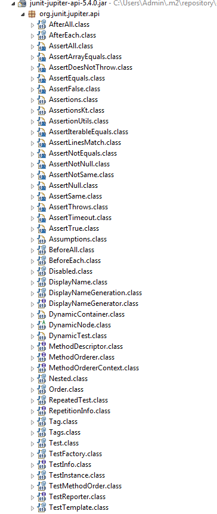

# JUnit5-basics

JUnit 5 = JUnit Platform + JUnit Jupiter + JUnit Vintage

### Getting Started : Apache Maven
you can simple add the below dependency to your pom.xml

```
<properties>
	<maven.compiler.source>11</maven.compiler.source>
	<maven.compiler.target>${maven.compiler.source}</maven.compiler.target>
	<junit.jupiter.version>5.4.0</junit.jupiter.version>
</properties>

<dependency>
	<groupId>org.junit.jupiter</groupId>
	<artifactId>junit-jupiter-api</artifactId>
	<version>${junit.jupiter.version}</version>
	<scope>test</scope>
</dependency>
<dependency>
	<groupId>org.junit.jupiter</groupId>
	<artifactId>junit-jupiter-engine</artifactId>
	<version>${junit.jupiter.version}</version>
	<scope>test</scope>
</dependency>
```

------------------------------------------------------------
### API Lifecycle
JUnit5 has created a lifecycle for its api as detailed in `API.java`. You can also refer to [https://github.com/apiguardian-team/apiguardian/blob/master/src/main/java/org/apiguardian/api/API.java](url "apiguardian") 


	/**
		 * Must not be used by any external code. Might be removed without prior
		 * notice.
		 */
		INTERNAL,
		/**
		 * Should no longer be used. Might disappear in the next minor release.
		 */
		DEPRECATED,
		/**
		 * Intended for new, experimental features where the publisher of the
		 * API is looking for feedback.
		 *
		 * <p>Use with caution. Might be promoted to {@link #MAINTAINED} or
		 * {@link #STABLE} in the future, but might also be removed without
		 * prior notice.
		 */
		EXPERIMENTAL,
		/**
		 * Intended for features that will not be changed in a backwards-
		 * incompatible way for at least the next minor release of the current
		 * major version. If scheduled for removal, such a feature will be
		 * demoted to {@link #DEPRECATED} first.
		 */
		MAINTAINED,
		/**
		 * Intended for features that will not be changed in a backwards-
		 * incompatible way in the current major version.
		 */
		STABLE;

As mentioned above it is better to avoid any API annotated with `@API(status = EXPERIMENTAL)` or `@API(status = INTERNAL)`
unit it has been promoted to `STABLE` status.

for example currently DisplayNameGenerator is in `EXPERIMENTAL` status

```
/**
 * {@code DisplayNameGenerator} defines the SPI for generating display
 * names programmatically.
 *
 * <p>An implementation must provide an accessible no-arg constructor.
 *
 * @since 5.4
 * @see DisplayName
 * @see DisplayNameGeneration
 */
@API(status = EXPERIMENTAL, since = "5.4")
public interface DisplayNameGenerator {

....
}

```
------------------------------------------------------------
### Annotations

All annotation are located in `org.junit.jupiter.api` within junit-jupiter-api-<version>.jar as shown in below image




**JUnit 4**|**JUnit Jupiter**
:-----:|:-----:
@org.junit.Test|@org.junit.jupiter.api.Test | 
@BeforeClass|@BeforeAll
@AfterClass|@AfterAll
@Before|@BeforeEach
@After|@AfterEach
@Ignore|@Disabled


------------------------------------------------------------

## References

*   [https://blog.codefx.org/design/architecture/junit-5-architecture-jupiter/](url "junit-5-architecture") 
*   [https://junit.org/junit5/docs/current/user-guide](url "junit5 user guide")
*	[https://www.eclipse.org/community/eclipse_newsletter/2017/october/article5.php](url eclipse.org) 


